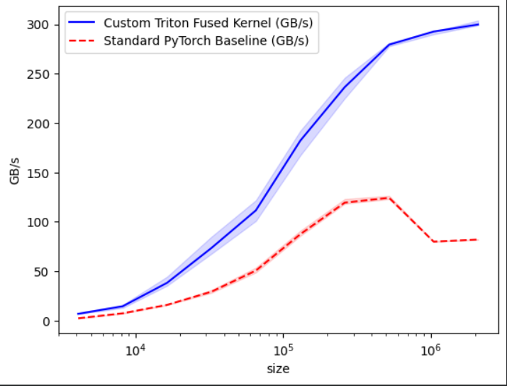

# Triton Fused Quantization Benchmark

A reproducible efficient-AI prototype with a custom Triton kernel for fused dequantization, addition, and ReLU.

## Features
- INT8 quantization validation
- Custom Triton kernel
- Benchmark vs PyTorch baseline
- Numerical correctness checks

## Run
```bash
python quant_validation.py
python benchmark.py
```

## Results
Benchmark graph will appear in `figures/benchmark.png.png`.

